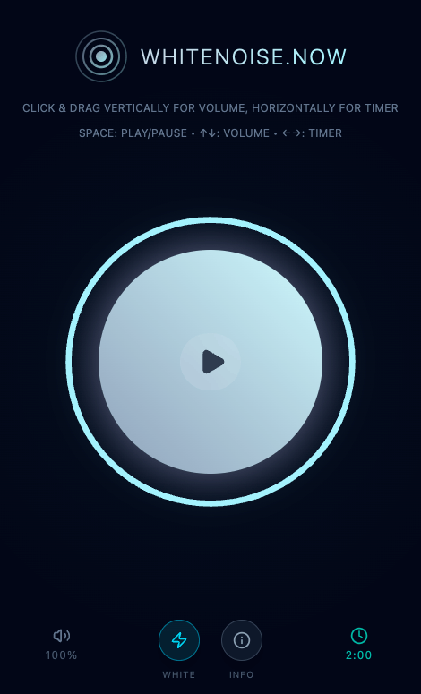

# White Noise Now

A browser-based white noise and brown noise generator with an intuitive gesture-based interface. Perfect for focus, sleep, or relaxation.



## Features

- **White Noise**: High-frequency sound ideal for masking distractions and improving focus
- **Brown Noise**: Deep, rumbling sound perfect for sleep and relaxation
- Gesture-based controls
- Keyboard shortcuts
- Sleep timer
- Works offline
- PWA support built-in

## Quick Start

### Development

Install dependencies:
```sh
pnpm install
```

Start the development server:
```sh
pnpm dev
```

Visit `localhost:4321` in your browser.

## Technical Details

### Tech Stack
- **Framework**: Astro 5 with React 19 integration
- **Styling**: Tailwind CSS 4
- **Icons**: Lucide React
- **TypeScript**: Strict mode enabled

### Audio System
The app generates noise programmatically using the Web Audio API rather than playing audio files:

- **White Noise**: Random values between -1.0 and 1.0 for full-spectrum sound
- **Brown Noise**: Leaky integrator algorithm for deep, low-frequency rumble
- **Buffer Generation**: 2-second audio buffers created on-the-fly
- **Looping**: Seamless buffer source node looping for continuous playback
- **Volume Control**: Gain node with smooth ramping to prevent audio clicks
- **Safety Cap**: Maximum volume limited to 30% of full gain to protect hearing

